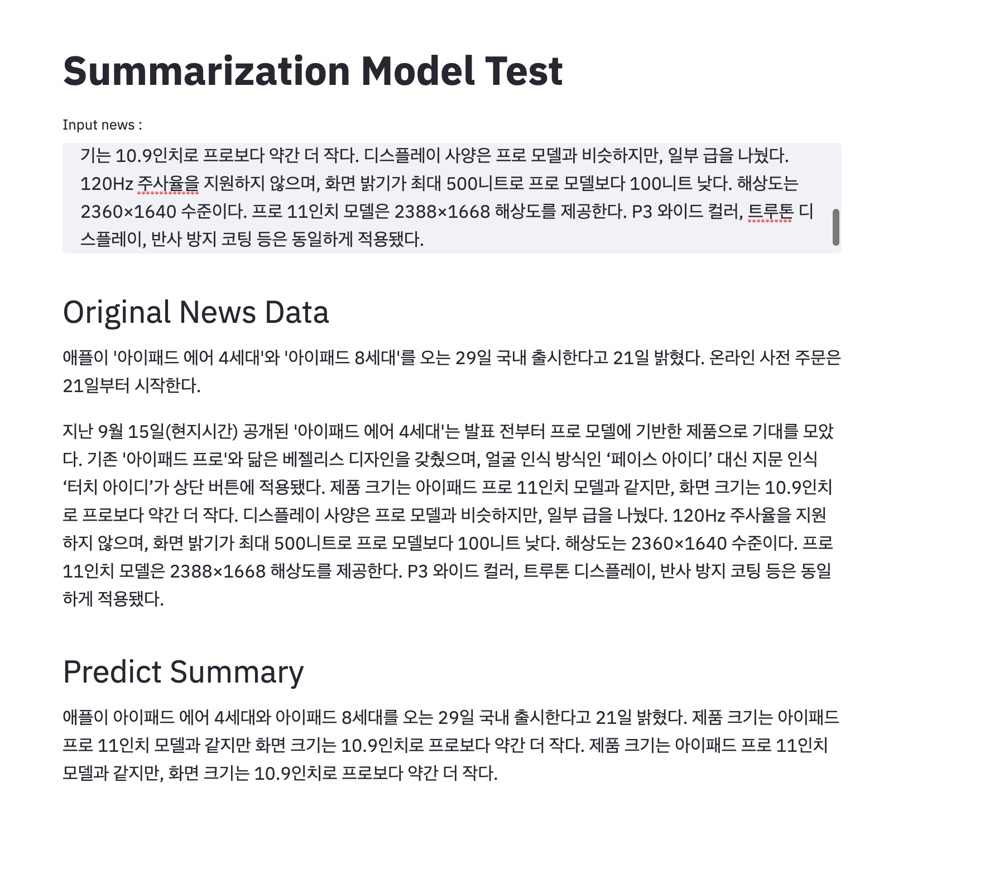

# t5-summarization
Summarization model using T5-base for Korean

## Requirements
- torch==1.6.0
- transformers==3.0.1
- streamlit==0.62.1
- gdown

## How to use
1. install requirements
```
pip install -r requirement.txt
```

2. Download model binary
```
python download.py
```
- model binary : 800MB

3. Run streamlit (default port:8501)
```
run.sh
```

## Demo

- News [link](http://www.bloter.net/archives/464015)
```
애플이 '아이패드 에어 4세대'와 '아이패드 8세대'를 오는 29일 국내 출시한다고 21일 밝혔다. 온라인 사전 주문은 21일부터 시작한다.

지난 9월 15일(현지시간) 공개된 '아이패드 에어 4세대'는 발표 전부터 프로 모델에 기반한 제품으로 기대를 모았다. 기존 '아이패드 프로'와 닮은 베젤리스 디자인을 갖췄으며, 얼굴 인식 방식인 ‘페이스 아이디’ 대신 지문 인식 ‘터치 아이디’가 상단 버튼에 적용됐다. 제품 크기는 아이패드 프로 11인치 모델과 같지만, 화면 크기는 10.9인치로 프로보다 약간 더 작다. 디스플레이 사양은 프로 모델과 비슷하지만, 일부 급을 나눴다. 120Hz 주사율을 지원하지 않으며, 화면 밝기가 최대 500니트로 프로 모델보다 100니트 낮다. 해상도는 2360×1640 수준이다. 프로 11인치 모델은 2388×1668 해상도를 제공한다. P3 와이드 컬러, 트루톤 디스플레이, 반사 방지 코팅 등은 동일하게 적용됐다.

특히, 아이패드 에어 4세대에는 '아이폰12'에 앞서 A14 바이오닉 칩이 처음으로 적용됐다. 5나노 공정 기술이 적용됐으며, 6코어 CPU, 4코어 그래픽 아키텍처로 구성됐다. 전작보다 CPU 성능은 40%, GPU 성능은 30% 개선됐다. 또 2세대 머신러닝 가속기가 탑재돼 기존 제품보다 10배 빠른 머신러닝 연산 속도를 제공한다. 폼팩터가 프로 11인치 모델과 같은 만큼 액세서리도 호환된다. '애플펜슬 2세대', '매직 키보드', '스마트 키보드 폴리오' 등을 그대로 이용할 수 있다.
```

- Summary
```
애플이 아이패드 에어 4세대와 아이패드 8세대를 국내 출시한다고 21일 밝혔다. 제품 크기는 아이패드 프로 11인치 모델과 같지만 화면 크기는 10.9인치로 프로보다 약간 더 작으며, 프로보다 약간 더 작다. 아이패드 에어 4세대에는 아이폰12에 앞서 A14 바이오닉 칩이 처음으로 적용됐다.
```